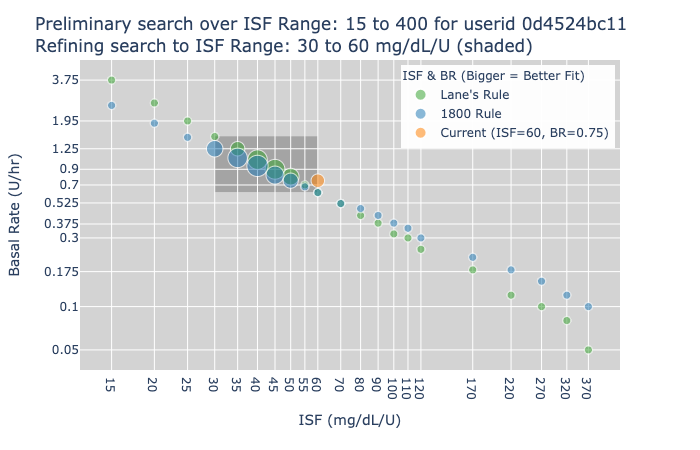
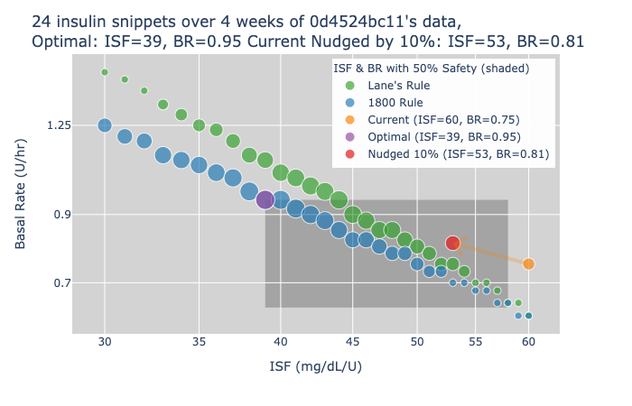
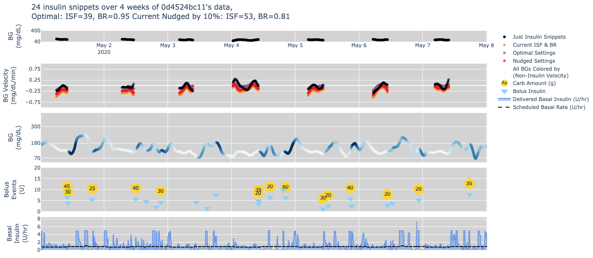

# Estimate Basal Rate and ISF using Tidepool Donor Data
Author: Ed Nykaza

Created: 2020-03-13

Last Updated: 2020-05-01

## Project Disclaimer: [WIP] Exploratory
This is work is exploratory and under development.
It is not intended to be used or distributed as a medical device.

This is the first of several estimators I intend to build to help with determining Loop Settings.
Here is the general model that is being solved using bounded or constrained optimization:

    dBG[t,v] = EGP[t] - insulinEffect[t] + carbEffect[t] + activityEffect[t] + timingEffects[t] + valueEffects[t,v]

Though, for this version of the code, only the first two factors are being solved for:

    dBG[t,v] = EGP[t] - insulinEffect[t]
    dBG[t,v] = ISF(basalRate/60 - insulinEffect[t])

## Key Assumptions
* Data comes from Tidepool using API (user is prompted for credentials)
* Estimator uses one of the three DIY Loop Insulin Models (user is prompted)
* User will be asked for settings, but the current settings are NOT used in the estimate
* All data is rounded to the nearest minute
* All gaps of cgm data < 2 hours are linearly interpolated
* All cgm data, and bg velocity data are smoothed using a 120-minute centered rolling average
* Estimator looks for just-insulin-snippets > 120 minutes according to the following criteria:
    * only searches over the time period between 12am and 12pm local time
    * all cgm data is present over the length of the snippet (120 minutes)
    * the snippet starts > 5 hours after the last carb event
    * the smoothed bg velocity is does not exceed +/- 0.25 mg/dL/min over the entire snippet

## Estimator Process
Plug in a given insulin sensitivity factor (ISF) and basal Rate (BR) in the following bg velocity equation:

    dBG[t,v] = ISF(basalRate/60 - insulinEffect[t]),

and calculate the root mean squared error (RMSE) between the
smoothed bg velocity and the estimated bg velocity (dBG). Only use the just-insulin-snippets (defined above)

1. Quickly search over the ISF Range of 15 to 400 to get into the general ballpark (Figure 1):

2. Do a narrower and finer search over ISF range (Figure 2):

3. Provide a visual of all of the data used to make the estimate (Figure 3):

## Next Actions
* Calculate metrics that indicate whether the PWD should consider making settings changes
    * time in range(s), hypo and hyper episodes
    * stability of the system, which could include the loop algorithm or the user
* Show how the settings fit changes over time
* Refine Safety Criteria
* Consider other Rules beyond the 1800 Rule and Lane's Rule
* Solve for different insulin curves
    * optimize for the best DIY Loop Insulin Model
    * solve for other insulin curves
* Use the non-insulin bg velocity as a way to pick out missed carb and activity events
* Solve for carb amounts, carb activity curves

---
### Technologies (Update this list)
* Python (99% of the time)
* [Anaconda](https://www.anaconda.com/) for our virtual environments
* Pandas for working with data (99% of the time)
* Google Colab for sharing examples
* Plotly for visualization
* Pytest for testing
* Travis for continuous integration testing
* Black for code style
* Flake8 for linting
* [Sphinx](https://www.sphinx-doc.org/en/master/) for documentation
* Numpy docstring format
* pre-commit for githooks

## Getting Started with the Conda Virtual Environment
1. Install [Miniconda](https://conda.io/miniconda.html). CAUTION for python virtual env users: Anaconda will automatically update your .bash_profile
so that conda is launched automatically when you open a terminal. You can deactivate with the command `conda deactivate`
or you can edit your bash_profile.
2. If you are new to [Anaconda](https://docs.anaconda.com/anaconda/user-guide/getting-started/)
check out their getting started docs.
3. If you want the pre-commit githooks to install automatically, then following these
[directions](https://pre-commit.com/#automatically-enabling-pre-commit-on-repositories).
4. Clone this repo (for help see this [tutorial](https://help.github.com/articles/cloning-a-repository/)).
5. In a terminal, navigate to the directory where you cloned this repo.
6. Run `conda update -n base -c defaults conda` to update to the latest version of conda
7. Run `conda env create -f conda-environment.yml --name [input-your-env-name-here]`. This will download all of the package dependencies
and install them in a conda (python) virtual environment. (Insert your conda env name in the brackets. Do not include the brackets)
8. Run `conda env list` to get a list of conda environments and select the environment
that was created from the environmental.yml file (hint: environment name is at the top of the file)
9. Run `conda activate <conda-env-name>` or `source activate <conda-env-name>` to start the environment.
10. If you did not setup your global git-template to automatically install the pre-commit githooks, then
run `pre-commit install` to enable the githooks.
11. Run `deactivate` to stop the environment.

## Contributing Guide
1. All are welcome to contribute to this project.
1. Naming convention for notebooks is
`[short_description]-[initials]-[date_created]-[version]`,
e.g. `initial_data_exploration-jqp-2020-04-25-v-0-1-0.ipynb`.
A short `_` delimited description, the creator's initials, date of creation, and a version number,
1. Naming convention for data files, figures, and tables is
`[PHI (if applicable)]-[short_description]-[date created or downloaded]-[code_version]`,
e.g. `raw_project_data_from_mnist-2020-04-25-v-0-1-0.csv`,
or `project_data_figure-2020-04-25-v-0-1-0.png`.

NOTE: PHI data is never stored in github and the .gitignore file includes this requirement as well.

## Tidepool Data Science Team
|Name (with github link)    |  [Tidepool Slack](https://tidepoolorg.slack.com/)   |
|---------|-----------------|
|[Ed Nykaza](https://github.com/[ed-nykaza])| @ed        |
|[Jason Meno](https://github.com/[jameno]) |  @jason    |
|[Cameron Summers](https://github.com/[scaubrey]) |  @Cameron Summers    |
